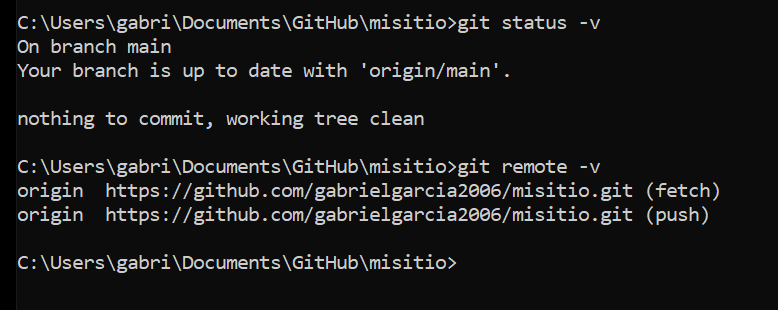
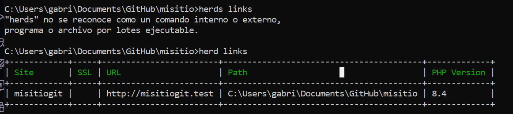
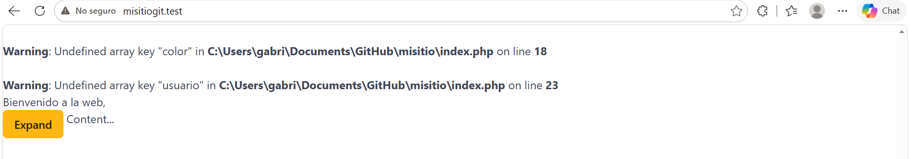

# Práctica 01

## Git instalado y configurado

He comprobado que Git está instalado correctamente en el equipo.

/** En la captura se puede ver la versión de Git instalada. */

)

## GitHub CLI instalado y configurado

He comprobado que GitHub CLI está instalado y que tengo la sesión iniciada correctamente.

/** En la captura se ve la versión de GitHub CLI y el estado de autenticación. */

## Herd y PHP 8.4

He comprobado que Laravel Herd está instalado y que estoy utilizando PHP 8.4

/** En la captura se puede ver la versión de Herd y la versión de PHP. */

## Repositorio clonado en local

He comprobado que el repositorio `misitio` está clonado en local y conectado con GitHub.

/** En la captura se muestra el repositorio remoto configurado. */

## Herd enlazado al proyecto

He comprobado que Herd tiene enlazado correctamente el proyecto `misitio`.

/** En la captura se puede ver el proyecto dentro de los enlaces de Herd. */

## Proyecto funcionando con HTTPS

He comprobado que el proyecto funciona correctamente desde `https://misitio.test`.

/** En la captura se puede ver la página cargada mediante HTTPS. */

## Herramientas utilizadas

Para realizar la práctica he utilizado Git, GitHub CLI, Laravel Herd, PHP 8.4 y ProperDocs.

/** La documentación está escrita en Markdown y las capturas están guardadas dentro de `docs/img`. */